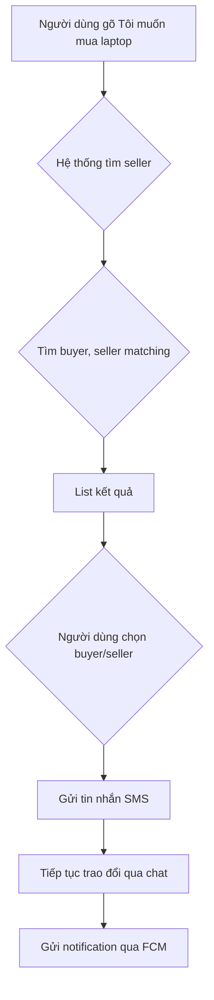

# Build chat app dùng để đăng tin mua bán.

## Sản phẩm này làm về gì ?

- Người dùng nhắn tin đăng bán + đăng mua, hệ thống tự động dùng NPL để phân loại tin và đưa ra seller, buyer matching tương ứng, User lựa chọn xong sẽ matching tiến hành chat tiếp tục 
để trao đổi + đồng thời hệ thống sẽ tự động gửi tin nhắn SMS cho người mua hoặc người bán (là owner của topic đó), đồng thời gửi notification thông qua FCM với shorcut @{username}

## Sản phẩm cho ai ?

- Người mua và người bán sản phẩm.

## Sản phẩm giải quyết vấn đề gì ?
Khác gì với chợ tốt hay mua bán online truyền thống.
- Không có form đăng tin, chỉ có tin nhắn => ** Nhanh, gọn nhẹ **
- Tự động phân loại tin và matching => ** Công cụ matching bên mua bán với ít thao tác nhất nhất, có thể nhờ AI agent viết truy vấn elasticsearch **
- Không cần vào nhiều forum để tìm tin, hay chọn categories, chỉ cần chat ra lệnh.
- Tự động gửi tin nhắn SMS cho người mua hoặc người bán (là owner của topic đó), gửi notification thông qua FCM ** Thông báo với ít bước nhất, dễ dàng touch đến khách hàng **

## Các tính năng và luồng cơ bản như sau:
- Đăng nhập/Đăng ký qua facebook
- Người dùng gõ "Tôi muốn mua laptop " => hệ thống sẽ tìm seller.
- Hệ thống sẽ tìm buyer, seller matching với nhu cầu của người gõ này, nó sẽ list kết quả. Phân loại tin theo (sell/buy) category, location, price, etc.
- Người dùng chọn 1 (buyer, seller), hệ thống sẽ tự động gửi tin nhắn SMS cho người mua hoặc người bán (là owner của topic đó).
- Hai bên tiếp tục trao đổi thông qua chat.
- Gửi notification thông qua FCM

## Các hướng phát triển sau này.
- Tạo ra các MCP server, mỗi server đại diện cho các nguồn thông tin (chợ tốt, group facebook, etc), nếu không tìm thấy buyer, seller matching, hệ thống sẽ tìm kiếm trong các MCP server này.
- Có 1 dashboard admin để quản lý các thread, tin nhắn, user, và các thông tin khác.

## Tech.

- Golang 
- MongoDB
- Firebase
- NPL
- Nextjs
- SMS
